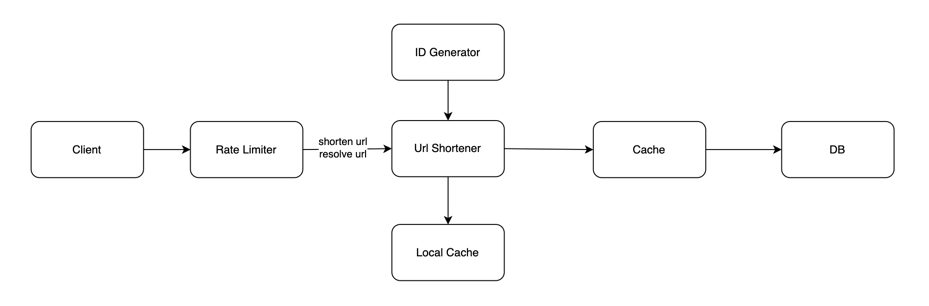
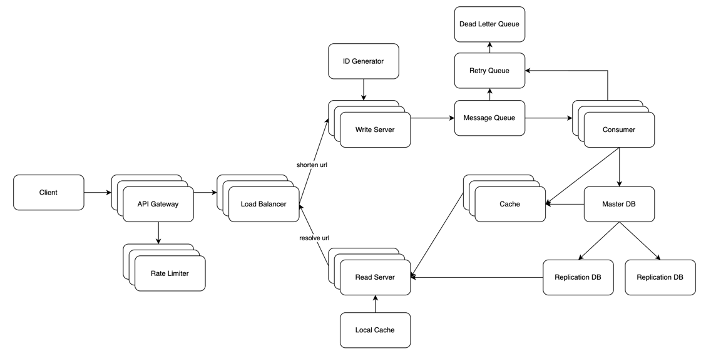

# URL Shortener

This project provides a URL shortening service that converts long URLs into shorter ones.

- Users submit a long URL to receive a shortened URL.
- Users can use the shortened URL to redirect to the original URL.

## Functional Requirements

1. **URL Shortening** : Users submit a long URL to receive a shortened URL.
2. **URL Redirection** : Users can use the shortened URL to be redirected to the original URL.

## Non-Functional Requirements

1. High Scalability: Load balancer, DB replication, Redis cluster.
2. High Availability: Load balancer, Auto scaling, DB replication, Redis cluster, Health check
3. Low Latency: Hybrid cache, DB replication, Message Queue
4. Uniqueness Guarantee: Base58, ID Generator

## Technology Stack

- Java 21
- Kotlin 1.9.25
- Spring Boot 3.4.1
- PostgreSQL 17
- Redis 8
- Caffeine
- Docker
- JUnit 5

## Installation and Execution

Run using Docker:

```shell
make run
```

## API Specifications

### 1. URL Shortening
URL shortening API to shorten a long URL

```shell
POST /api/v1/shorten
```

Request Body:
```json
{
   "longUrl": "https://example.com/long-url",
   "userId": 1
}
```

Response:
```json
Status: 201
```

Status:

- `201` Create: Successfully created a shortened URL.
- `400` Bad Request: Invalid URL input.

### 2. URL Redirection
API for redirecting to the original URL with the shortened URL

```shell
GET /{hash}
```

Response:

```shell
HTTP/1.1 301 Moved Permanently
Location: "https://example.com/long-url"
```

### 3. Find URLs by userId
Find the shorten and original URLs that user have

```shell
GET /api/v1/users/{userId}/urls
```
Response:
```shell
[
  {
    "id": 1,
    "longUrl": "http://amazon.com",
    "shortUrl": "http://localhost:8080/3gXe",
    "hash": "3gXe",
    "userId": 1,
    "createdAt": "2025-01-06T00:14:12.429006",
    "updatedAt": "2025-01-06T00:14:12.429006"
  },
]
```

## Database Schema
URL Table

| Field Name | Type      | Description            |
|------------|-----------|------------------------|
| id         | SERIAL    | Primary key            |
| long_url   | VARCHAR   | Original URL           |
| short_url  | VARCHAR   | Shortened URL          |
| hash       | VARCHAR   | Hash for short URL     |
| userId     | BIGINT    | User Identity          |
| createdAt  | TIMESTAMP | Creation date time     |
| updatedAt  | TIMESTAMP | Modification date time |

## Testing

Run tests using JUnit 5:

```shell
make test
```

## Current Architecture

High-level design of current architecture

## Future Architecture

High-level design of future architecture

- [Response Code](docs/ResponseCode.md)
- [Unique URL](docs/UniqueURL.md)
- [Database](docs/Database.md)
- [Cache](docs/Cache.md)
- [ID Generator](docs/IDGenerator.md)
- [Message Queue](docs/MessageQueue.md)
- [Rate Limiter](docs/RateLimiter.md)

## Performance Test
Test Machine Specifications
- Processor: Apple M3 Pro
- Cores: 11 cores
- Memory: 36GB

Load Test APIs
1. [URL Shortening API](docs/test/ShortenUrlPerformanceTest): generate a shortened version of a provided URL
2. [Short URL resolution API](docs/test/ResolveUrlPerformanceTest.md): resolves a shortened URL and redirect the user to the origin URL
