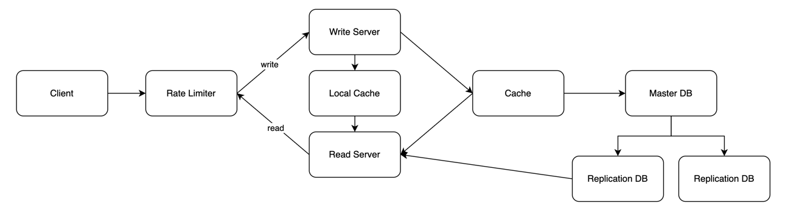

# URL Shortener

This project provides a URL shortening service that converts long URLs into shorter ones.

- Users submit a long URL to receive a shortened URL.
- Users can use the shortened URL to redirect to the original URL.

# Functional Requirements

1. URL Shortening
  - Users submit a long URL to receive a shortened URL.
2. URL Redirection
  - Users can use the shortened URL to be redirected to the original URL.

> Unconsidered Requirements:
>
> - Users can optionally specify a custom alias.
> - Users can optionally specify an expiration date.

# Non-Functional Requirements

1. High Scalability: Load balancer, DB replication, Redis cluster.
2. High Availability: 99.99%
3. Low Latency: Hybrid cache, DB replication.
4. Uniqueness Guarantee: Hash keys.

# Technology Stack

- Java 21
- Kotlin 1.9.25
- Spring Boot 3.4.1
- PostgreSQL 17
- Redis 8
- EhCache
- Docker
- JUnit 5

# Installation and Execution

Run using Docker:

```shell
docker-compose up
```

# API Specifications

### 1. URL Shortening

```shell
POST /api/v1/shorten

```

Request Body:
```json
{
   "longUrl": "https://example.com/long-url"
}

```

Response:
```json
{
   "id": "1",
   "longUrl": "https://example.com/long-url",
   "shortUrl": "http://localhost/{hash}"
}

```

Status:

- `200` Success: Successfully created a shortened URL.
- `400` Bad Request: Invalid URL input.

### 2. URL Redirection

```shell
GET /{hash}
```

Response:

```shell
HTTP/1.1 301 Moved Permanently
Location: "https://example.com/long-url"
```

# Database Schema

| Field Name | Type | Description |
| --- | --- | --- |
| id | SERIAL | Primary key |
| long_url | VARCHAR | Original URL |
| short_url | VARCHAR | Shortened URL |
| createdDate | TIMESTAMP | Creation date |
| modifiedDate | TIMESTAMP | Modification date |

# Testing

Run tests using JUnit 5:

```shell
./gradlew test
```

# High-Level Design



# Details

<details>
<summary>Response Code</summary>

🟢 **Status Code `301`** 🟢

- Prevents traffic loss through browser caching.
- Generally used for permanent URL redirection.
- Adjust `Cache-Control` and `Expires` headers when changing URLs.

### 301 Moved Permanently

- Permanently redirects the URL.
- Internally utilizes browser caching.
- Advantages:
  - SEO-friendly: Prompts search engines to update the indexed URL.
  - Prevents traffic loss: Cached URL reduces server traffic.
- Disadvantages:
  - Difficult to change: Permanent setting can complicate updates.
  - Caching: Requires additional work to update redirection.

### 302 Found

- Temporarily redirects the URL.
- Advantages:
  - Temporary redirection: Suitable for event or promotion pages.
  - No impact on search engines: Original URL remains indexed.
- Disadvantages:
  - Traffic loss: URL redirection occurs every time.

</details>
<details>
<summary>Unique URL</summary>

🟢 **Auto-Generated ID + Base58** 🟢

- Combines uppercase letters, lowercase letters, and 58 digits.
- Easy for humans to read.
- Allows generation of diverse URLs (e.g., 6 characters can create 38 billion URLs).
- Uses auto-generated database keys.

### 1. Base58

Uses 58 combinations of uppercase letters, lowercase letters, and digits (excluding 0, O, l, I).

- Advantages:
  - Prevents confusion: Easy for humans to read, reducing errors (e.g., avoiding 0/O/l/I confusion).
  - Shorter URLs: More efficient than Base62.
- Disadvantages:
  - Smaller character set: Fewer combinations than Base62.
  - Limited special characters.

### 2. Base62

Uses 62 combinations of uppercase letters, lowercase letters, and digits.

- Advantages:
  - Larger combinations: Utilizes all 62 characters.
  - Short URLs: Efficient and widely compatible.
  - Excludes special characters: Suitable for various systems.
- Disadvantages:
  - Similar characters may cause confusion (e.g., 0/O/l/I).

### 3. Hash

- Advantages:
  - Guarantees consistent output length.
  - Low collision probability.
  - Produces the same result for identical inputs.
- Disadvantages:
  - Potential collisions.
  - Long URLs may require trimming hash values.

### 4. UUID

- Advantages:
  - High uniqueness.
  - Extremely low collision probability.
- Disadvantages:
  - Long URLs.
  - Hard to read.

</details>
<details>
<summary>Database</summary>

🟢 **DB Replication** 🟢

- Improved read performance: Master for writes, replicas for reads.
- Scalability and availability: Backup in case of failures.
- Load distribution: Spreads read and write operations across replicas.

</details>
<details>
<summary>Cache</summary>

🟢 **Hybrid Cache** 🟢
Uses both local and remote cache.
* Local Cache: EhCache
* Remote Cache: Redis (Lettuce)

- Low latency: Local cache is faster than remote.
- Prevents cache stampede: Minimizes backend load when cache is missing.
- Cache warm-up: Updates local cache during server startup.

### Lettuce
* pros:
  * Asynchronous and non-blocking for high-concurrency environments. 
  * Thread-safe, supports multi-threaded applications. 
  * Built-in Redis cluster and sharding support. 
  * Supports reactive programming. 
* cons:
  * More complex to use (requires understanding of async programming). 
  * May use more memory due to async I/O model.

### Jedis
* pros:
  * Simple and easy to use (synchronous). 
  * Low memory overhead. 
  * Ideal for small-scale or single-instance Redis setups. 
* Cons:
  * Not thread-safe by default (requires separate connections per thread). 
  * Limited or more complex cluster and sharding support. 
  * Synchronous, which can be less efficient for high-concurrency use cases.

</details>

# Performance Test