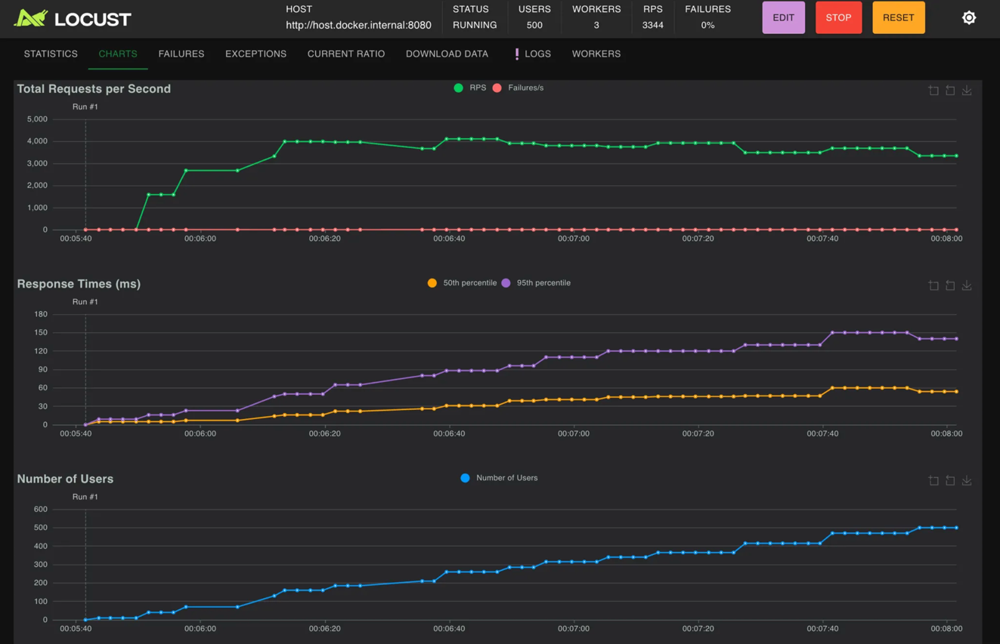
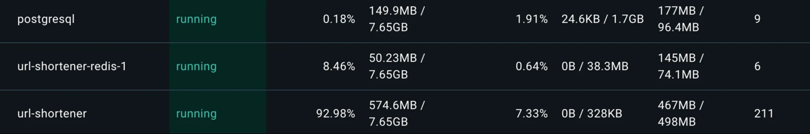
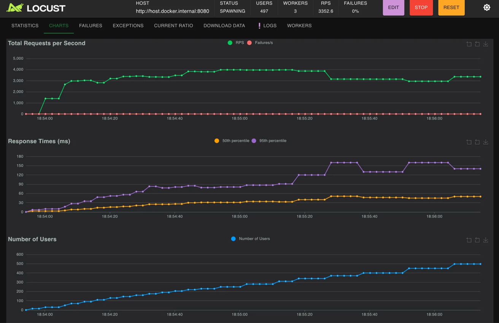
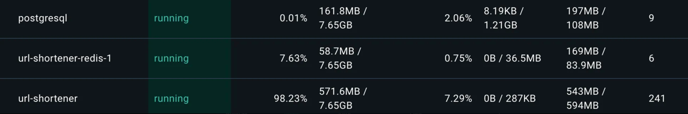
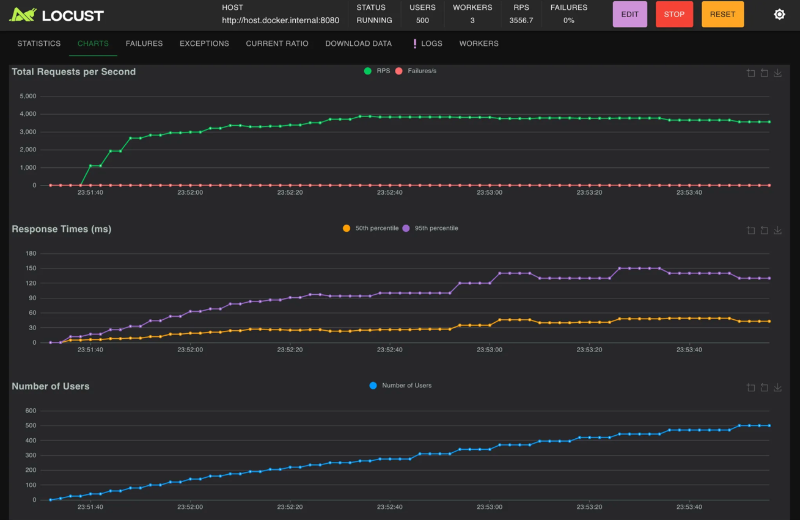

# Short URL resolution API

### Test Configuration
- Users: 500 test users
- Ramp-up: 5 minutes gradual ramp-up

### 1. Database Integration

tomcat
- max.thread: 200

hikari
- max.pool.size: 10
- connection.timeout: 1000

(Use the same configration for following tests)

### 2. Redis Integration

### 3. LocalCache Integration

